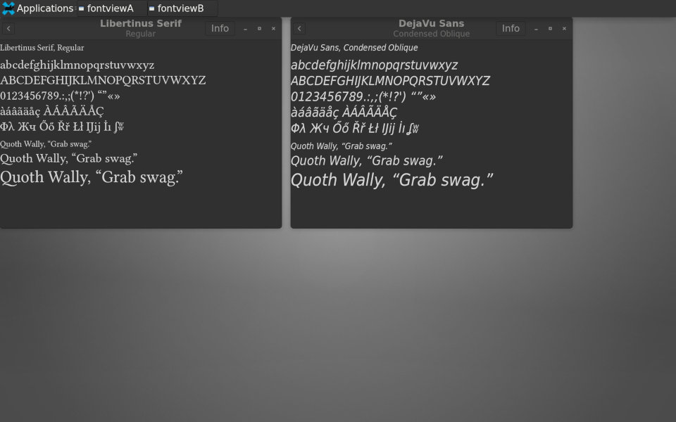

# Fontview Dual
Dual font viewers for Linux or Termux

## DESCRIPTION

Program `fontview-dual` provides two independent font viewers.
This allows you to display two fonts, side-by-side.

Beneath the selected font name, each viewer shows ASCII characters,
and selected characters in Latin-1, Latin-2, Greek, Cyrillic, Windows-1252.
If the display shows readable characters, then the font probably
supports the language set. But if it shows dingbats or the missing-character
symbol, then it does not. For further investigation, you need another program.

Only European right-to-left languages are supported.

The software automatically honors system light-dark theme.
Controls are few, and easily understood.

## PLATFORM:

This software is intended for Linux. It can also be used in Termux,
with a GUI (such as xfce4) enabled. You do not need root or proot.

## USAGE:

When you choose `Fontview Dual` from your GUI Applications Menu,
it will display a list of installed fonts. Click a font name,
and sample text will appear at various sizes.

when you choose `Fontview Dual` from context menu (right-click) of a font file,
its sample text will appear. The font does not need to be installed.

In either case, the back button (top left of display) brings you to
the list of installed fonts.

The Info button shows font metadata.

You may have two, side-by-side, independent display windows. No more.

## HOW IT WORKS:

There are two independent binary programs, `fontviewA` and `fontviewB`.
Normally, they are not launched directly. The command-line `fontview-dual`
is launched by Menu `Fontview Dual`.

When you choose `Fontview Dual`, it detects whether `fontviewA` and/or
`fontviewB` is currently running. If neither, then `fontviewA` is launched.
If one of them is running, then the other is launched. No more.

The program does not create or display thumbnails.

## LICENSE:

Script `fontview-dual` Copyright 2022 Robert Allgeyer.

Source code has its own Copyrights and credits, written into the files.

Prior to edits, source code obtained from 'GNOME Font Viewer' project v41.0.

All released under GPLv2. See file LICENSE.

## VERSION:

41.0.1 - Minor corrections to '--help' text. No functional changes.

41.0 - Initial upload. Why 41.0? Based on GNOME Fonts v41.0 code.
